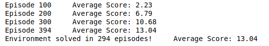
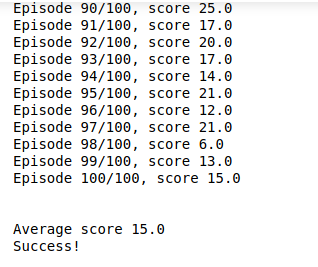
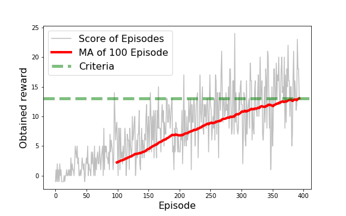

# REPORT 

The environment is based on Unity ML-agents

*Note:* The project environment provided by Udacity is similar to, but not identical to the Banana Collector environment on the Unity ML-Agents GitHub page.

Each time the agent collect a yellow banana, it’s given a reward of +1. For each blue banana, it received a -1 reward. The goal of the agent is to collect as many yellow bananas as possible and avoid any blue bananas, as it must increase the score given by the amount of rewards received.  

The state space has 37 dimensions and contains the agent's velocity, along with ray-based perception of objects around agent's forward direction.  Given this information, the agent has to learn how to best select actions.  4 discrete actions are available, corresponding to:

- **`0`** - move forward.
- **`1`** - move backward.
- **`2`** - turn left.
- **`3`** - turn right.

To complete the task the agent must get an average score of 13 over 100 consecutive episodes. 

This project implements a Value Based method named Deep Q-Networks, which combines two approaches: Q Learning (reinforcement learning method) and Q-table approximation learnt by a deep neural network.

### Neural network implementation
3 layers that include the input layer (37 dimensions), 1st hidden layer (64 dimensions), 2nd hidden layer (64 dimensions), 3rd output layer (4 dimensions representing each action). DNN was trained with Adam (Adaptive Moment Estimation). 
### Agent
Agent was trained with a maximum of 700 episodes, or once the achieved score is equal or more than 16. Epsilon decreases along the training steps from 1.0 down to 0.01 (with a decay of 0.99)
### Environment
Solved within 700 episodes (solved in 294 episodes: excellent result!)

And the average score produced after 100 iterations is above 13:

### Hyperparameters
 - Replay Buffer Size: 100000 
 - Batch Size: 64 
 - Gamma (discount factor): 0.99 
 - Tau (soft update): 0.003 
 - Learning Rate: 0.0005 
 - Update Network: 4 

### Plot of Rewards

The code consist of :

- QNetwork class: regular fully connected deep neural network using PyTorch. We can change the size of the hidden layers here. 
- Replay Buffer: initialize the buffer and the target and local neural networks. Every 4 steps it updates the target network weights with the current weight values from the.
- dqn_agent class: a DQN agent is defined.
